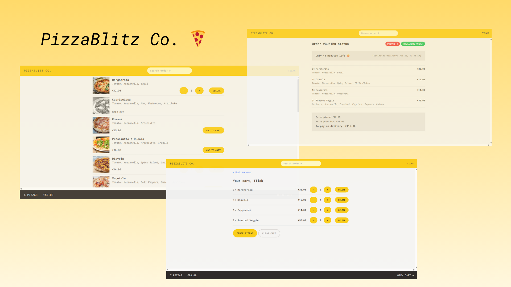
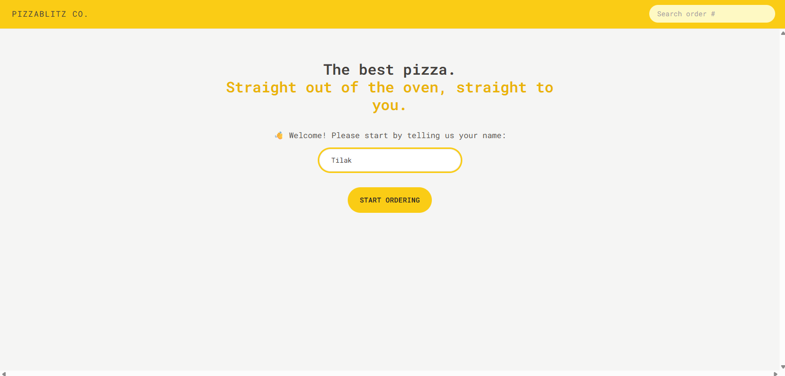
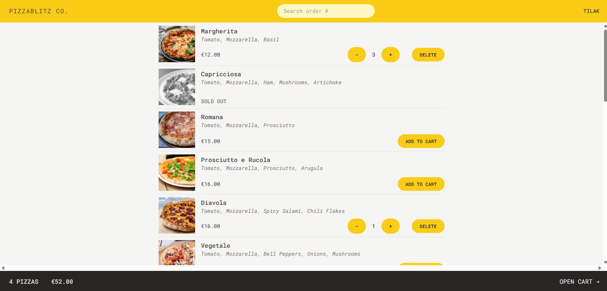
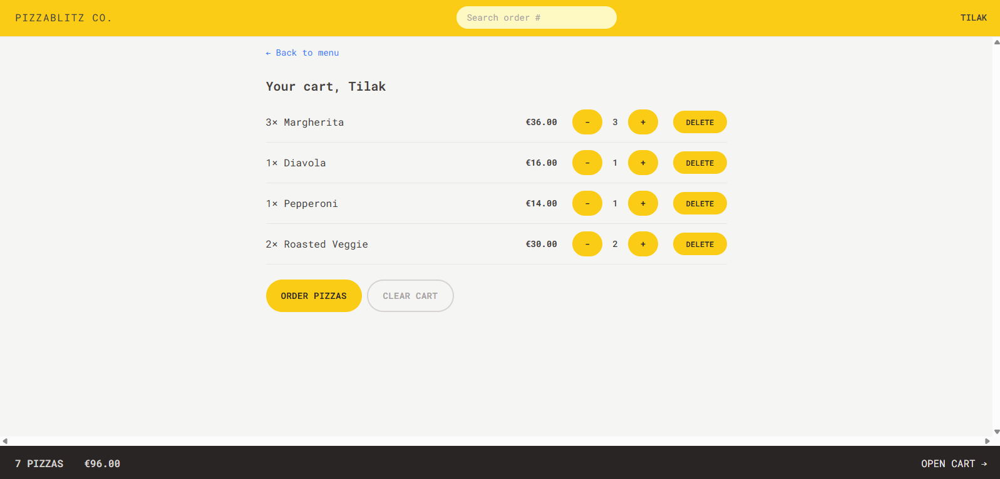
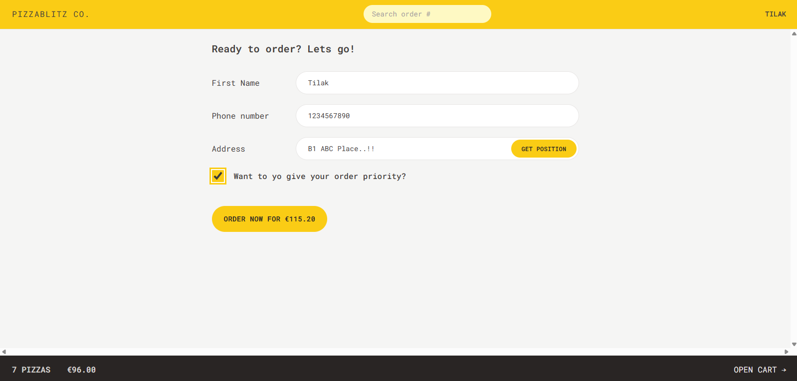
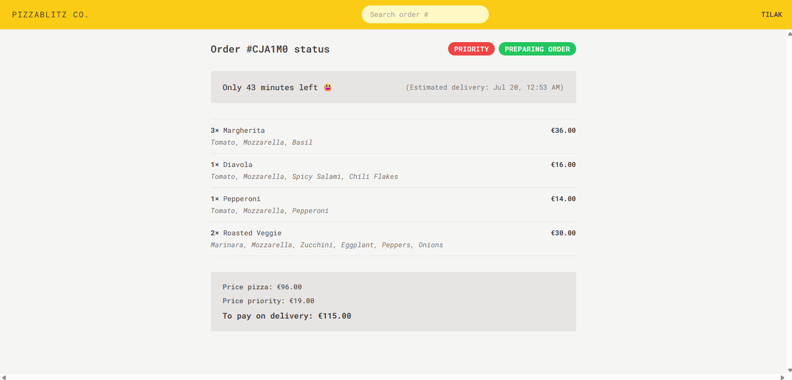
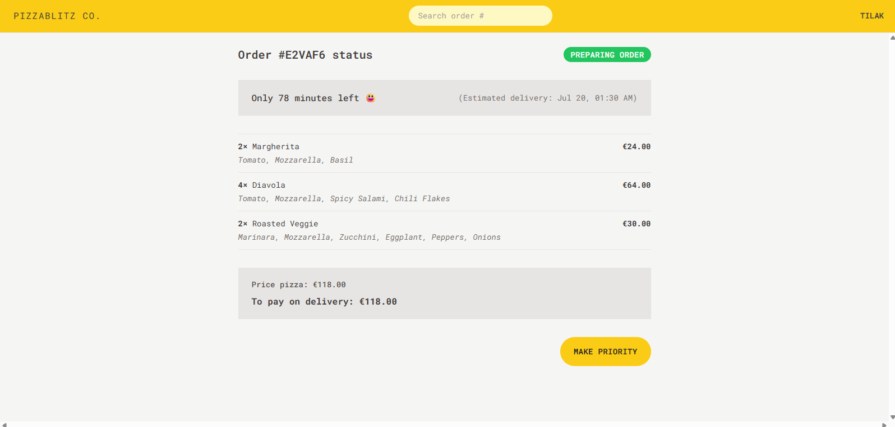

# 🍕 PizzaBlitz-Co



> A sleek and responsive pizza ordering application built using **React**, **Vite**, and **Tailwind CSS**. Developed as part of the Jonas Schmedtmann Fast React course, this app simulates a real-world pizza shop experience—from selecting items to placing orders.

[](https://pizza-blitz-by-tilak.netlify.app/order/E2VAF6)

---

## 📸 Screenshots

| Homepage                                              | Menu Page                                     |
| ----------------------------------------------------- | --------------------------------------------- |
|  |  |

| Cart Page                                     | Order Confirmation                                  |
| --------------------------------------------- | --------------------------------------------------- |
|  |  |

| Order Details                                      | Order Details With Make Priority Option                       |
| -------------------------------------------------- | ------------------------------------------------------------- |
|  |  |

---

## 🚀 Features

- 🍕 Select and customize pizzas from a dynamic menu
- 🛒 Add and remove pizzas from cart
- 💸 Automatic subtotal and total calculation
- 📝 Order placement with name & phone number
- ⚡ Optimistic UI updates for smooth experience
- 🌗 Fully responsive layout with Tailwind CSS
- 🧭 Seamless navigation using React Router v6

---

## 🛠 Tech Stack

- **Frontend:** React (with Vite), React Router
- **Styling:** Tailwind CSS
- **State Management:** useReducer, Context API
- **Deployment:** Netlify

---

## 📂 Project Structure

```
src/
├── components/         # Shared UI components
├── features/           # Feature-specific components (menu, cart, order)
├── services/           # All API fetching login in place
├── helper/             # Helper function
├── ui/                 # Page components (Homepage, Menu, Order, etc.)
├── App.jsx             # Main layout & routing
└── main.jsx            # App entry point
```

---

## 📦 Installation & Setup

1. **Clone the repository**

```bash
git clone https://github.com/Tilak46/PizzaBlitz-Co.git
cd PizzaBlitz-Co
```

2. **Install dependencies**

```bash
npm install
```

3. **Run locally**

```bash
npm run dev
```

4. **Build for production**

```bash
npm run build
```

---

## 🔗 Live Demo

- 🌍 **Live App:** [PizzaBlitz-Co on Netlify](https://pizza-blitz-by-tilak.netlify.app/order/E2VAF6)

---

## 🧠 What I Learned

This project helped me solidify:

- Component architecture in React
- Centralized state management with context + useReducer
- Using Tailwind CSS for pixel-perfect UI
- Navigating with React Router
- Handling form submissions and optimistic UI updates

---

## 🙋‍♂️ Author

**Tilak Patel**  
🔗 [GitHub @Tilak46](https://github.com/Tilak46)  
📫 [LinkedIn](https://www.linkedin.com/in/tilakpatel46/)

---

## 📄 License

This project is licensed under the [MIT License](LICENSE).
